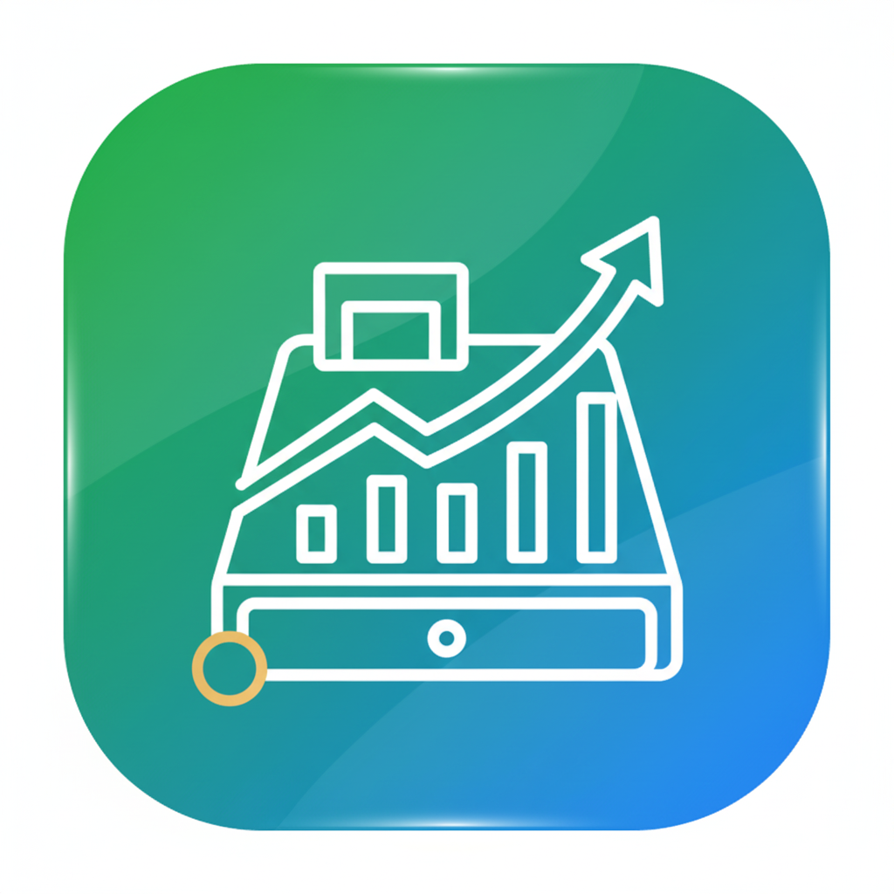

# 🚀 نظام نقاط البيع المتقدم - POS System# 🛒 نظام نقطة البيع المتكامل - POS System


<div align="center">نظام نقطة بيع احترافي ومتكامل مع قاعدة بيانات محلية دائمة.


## 🚀 البدء السريع


**نظام نقاط بيع احترافي متكامل**### 1. فتح التطبيق

افتح ملف `index.html` في المتصفح مباشرة، أو استخدم خادم محلي:

[](https://github.com)

[](LICENSE.txt)```bash

[](https://electronjs.org)# إذا كان لديك Node.js مثبت

npm start

</div>

# أو استخدم أي خادم محلي آخر

---python -m http.server 3000

```

## 📋 نظرة عامة

### 2. اختبار قاعدة البيانات

نظام نقاط بيع شامل ومتطور مصمم خصيصاً للمحلات التجارية والشركات الصغيرة والمتوسطة. يوفر إدارة كاملة للمنتجات والفواتير والديون مع دعم الطباعة الحرارية والعادية.افتح ملف `test_database.html` لاختبار نظام قاعدة البيانات والتأكد من عمله بشكل صحيح.


---## 📁 هيكل المشروع


## ✨ المميزات الرئيسية```

files/

### 🛍️ إدارة المنتجات├── index.html              # التطبيق الرئيسي

- ✅ إضافة وتعديل وحذف المنتجات├── test_database.html      # صفحة اختبار قاعدة البيانات

- ✅ إدارة المخزون بشكل تلقائي├── DATABASE_README.md      # دليل قاعدة البيانات

- ✅ تصنيف المنتجات مع أيقونات ملونة├── README.md              # هذا الملف

- ✅ تنبيهات المخزون المنخفض└── _sdk/                  # مكتبات قاعدة البيانات

- ✅ البحث السريع والتصفية المتقدمة    ├── data_sdk.js        # نظام IndexedDB للبيانات

- ✅ استيراد وتصدير المنتجات (Excel/CSV/JSON)    └── element_sdk.js     # نظام localStorage للإعدادات

```

### 💰 نظام الفواتير

- ✅ إنشاء فواتير بيع سريعة## ✨ المميزات

- ✅ دعم الخصومات والعروض

- ✅ حفظ الفواتير وطباعتها### 🗄️ قاعدة بيانات محلية دائمة

- ✅ البحث في سجل الفواتير- ✅ تخزين **IndexedDB** لجميع البيانات (منتجات، مبيعات، ديون)

- ✅ إحصائيات مبيعات مفصلة- ✅ تخزين **localStorage** للإعدادات

- ✅ طباعة إيصالات احترافية- ✅ البيانات تبقى محفوظة حتى بعد إغلاق المتصفح

- ✅ لا حاجة لخادم أو اتصال بالإنترنت

### 📊 إدارة الديون والأقساط

- ✅ تسجيل الديون بنظام أقساط مرن### 📥📤 نظام الاستيراد والتصدير (جديد!)

- ✅ تتبع المدفوعات والمتبقي- ✅ **استيراد** البيانات من JSON, Excel (.xlsx), CSV

- ✅ تنبيهات الديون المتأخرة- ✅ **تصدير** البيانات إلى JSON, Excel, PDF

- ✅ سجل كامل لعمليات التسديد- ✅ قوالب جاهزة للتعبئة والاستيراد

- ✅ تقارير مفصلة للديون- ✅ دعم كامل للمنتجات، الفواتير، والديون

- ✅ معالجة أخطاء ذكية ورسائل واضحة

### 🖨️ **نظام طباعة متقدم ومتكامل**

### 📦 إدارة المنتجات

#### ⚙️ إعدادات الطباعة الشاملة- إضافة وتعديل وحذف المنتجات

- ✅ **دعم جميع أنواع الطابعات:**- تصنيف المنتجات مع أيقونات مخصصة

  - طابعة حرارية 80mm- إدارة الكميات والأسعار

  - طابعة حرارية 58mm- نظام باركود تلقائي

  - طابعات عادية (A4, A5)- استيراد منتجات بالجملة

  

- ✅ **التحكم الكامل بأحجام الخطوط:**### 💰 نظام المبيعات

  - حجم عنوان المتجر (14-32px)- واجهة بيع سريعة وسهلة

  - حجم معلومات المتجر (10-20px)- حساب تلقائي للضرائب والخصومات

  - حجم نص الفاتورة (10-18px)- دعم طرق دفع متعددة (نقدي، بطاقة، تقسيط)

  - حجم جدول المنتجات (10-18px)- طباعة الفواتير

  - حجم الإجمالي (12-22px)

  - حجم التذييل (8-16px)### 📊 التقارير والإحصائيات

- تقارير المبيعات اليومية والشهرية

- ✅ **تنسيق الإيصال:**- تتبع الأرباح والإيرادات

  - ضبط المسافة بين الأسطر (1.0-2.0)- إحصائيات المنتجات الأكثر مبيعاً

  - الهوامش الجانبية والعلوية/السفلية (5-30px)- إدارة الديون والمدفوعات

  - نمط الحدود (متقطع/متصل/مزدوج/بدون)

  - سمك الحدود (1-3px)### 🎨 تصميم احترافي

  - محاذاة العنوان (وسط/يمين/يسار)- واجهة عصرية وسهلة الاستخدام

- دعم كامل للغة العربية (RTL)

- ✅ **خيارات العرض:**- ثيم فاتح وداكن

  - إظهار/إخفاء الشعار- رسوم متحركة سلسة

  - إظهار/إخفاء التاريخ والوقت

  - إظهار/إخفاء رقم الفاتورة## 🔧 التقنيات المستخدمة

  - إظهار/إخفاء جدول المنتجات

  - إظهار/إخفاء رسالة التذييل- **HTML5** - هيكل التطبيق

  - نص تذييل مخصص- **CSS3** - التصميم والرسوم المتحركة

- **JavaScript (Vanilla)** - المنطق البرمجي

- ✅ **وضعية الطباعة:**- **IndexedDB** - قاعدة البيانات المحلية

  - طباعة مباشرة للطابعة- **localStorage** - حفظ الإعدادات

  - معاينة قبل الطباعة- **SheetJS (xlsx)** - معالجة ملفات Excel

  - طباعة تجريبية لاختبار الإعدادات- **jsPDF** - توليد ملفات PDF

- **Font Awesome** - الأيقونات

- ✅ **معاينة مباشرة:**- **Google Fonts (Cairo)** - الخطوط العربية

  - معاينة فورية للتغييرات

  - محاكاة دقيقة للإيصال الفعلي## 📱 التوافق

  - تحديث تلقائي مع كل تعديل

يعمل التطبيق على جميع المتصفحات الحديثة:

### 📈 التقارير والإحصائيات- ✅ Google Chrome

- ✅ لوحة تحكم تفاعلية- ✅ Mozilla Firefox

- ✅ إحصائيات المبيعات اليومية- ✅ Microsoft Edge

- ✅ تقارير المخزون- ✅ Safari

- ✅ تقارير الديون- ✅ Opera


### 🎨 الواجهة والتصميم## 🛠️ الاستخدام

- ✅ واجهة عربية RTL كاملة

- ✅ وضع مظلم/فاتح### إضافة تصنيف جديد

- ✅ تصميم عصري وسهل الاستخدام1. انتقل إلى قسم "إدارة المنتجات"

2. اضغط على "إضافة تصنيف"

### 💾 قاعدة البيانات3. أدخل اسم التصنيف واختر أيقونة

- ✅ IndexedDB محلية - لا حاجة للإنترنت4. اضغط "حفظ" - سيتم الحفظ تلقائياً في قاعدة البيانات

- ✅ سعة تخزينية ضخمة (~280GB)

- ✅ نسخ احتياطي واستعادة### إضافة منتج جديد

1. انتقل إلى "إدارة المنتجات"

---2. اضغط على "إضافة منتج جديد"

3. املأ البيانات (الاسم، السعر، الكمية، التصنيف)

## 🖥️ متطلبات التشغيل4. اضغط "حفظ" - سيتم الحفظ في قاعدة البيانات


### الحد الأدنى### استيراد منتجات بالجملة (جديد!)

- **نظام التشغيل:** Windows 7 أو أحدث1. انتقل إلى "إدارة المنتجات"

- **المعالج:** Intel Core i32. اضغط على زر "استيراد" 📥

- **الذاكرة:** 4 GB RAM3. اختر ملف `products.json` أو قم بتعبئة `products_template.csv`

- **المساحة:** 500 MB4. سيتم استيراد جميع المنتجات تلقائياً!

5. راجع `QUICK_IMPORT.md` للتعليمات السريعة

### الموصى به

- **نظام التشغيل:** Windows 10/11 64-bit### إجراء عملية بيع

- **المعالج:** Intel Core i51. انتقل إلى قسم "نقطة البيع"

- **الذاكرة:** 8 GB RAM2. ابحث عن المنتجات وأضفها للسلة

- **المساحة:** 1 GB3. أدخل معلومات العميل (اختياري)

4. اختر طريقة الدفع

---5. أتمم العملية - سيتم حفظ البيع في قاعدة البيانات


## 📥 التثبيت والتشغيل### عرض التقارير

1. انتقل إلى قسم "التقارير"

### للمستخدمين:2. اختر نوع التقرير (يومي، أسبوعي، شهري)

1. قم بتحميل ملف `POS-System-Setup-1.0.0.exe`3. شاهد الإحصائيات والرسوم البيانية

2. شغّل الملف واتبع خطوات التثبيت

3. افتح التطبيق من سطح المكتب أو قائمة ابدأ## 💾 النسخ الاحتياطي والاستيراد/التصدير


### للمطورين:### التصدير السريع (من الواجهة)

1. افتح أي صفحة (المنتجات، الفواتير، الديون، المخزون)

#### 1️⃣ تثبيت المكتبات2. اضغط على أحد أزرار التصدير:

```bash   - **JSON** - للنسخ الاحتياطي الكامل

npm install   - **Excel** - للتحليل والتعديل

```   - **PDF** - للطباعة والأرشفة


#### 2️⃣ تشغيل التطبيق### الاستيراد السريع (من الواجهة)

```bash1. افتح الصفحة المطلوبة

npm start2. اضغط على زر "استيراد" 📥

```3. اختر ملف JSON, Excel, أو CSV

4. تتم المعالجة تلقائياً!

#### 3️⃣ بناء التطبيق

```bash### الملفات الجاهزة للاستيراد

npm run build-win- `products.json` - 20 منتج جاهز

```- `debts.json` - 10 دين جاهز

- `products_template.csv` - قالب للتعبئة

---- `debts_template.csv` - قالب للتعبئة


## 🎯 دليل الاستخدام السريع### النسخ الاحتياطي المتقدم (Console)

افتح Console المتصفح (F12) واكتب:

### إعداد الطابعة```javascript

1. اذهب إلى صفحة **الطباعة**const backup = window.dataSdk.exportData();

2. اختر نوع الطابعةconsole.log(backup); // انسخ البيانات واحفظها

3. اضبط أحجام الخطوط```

4. اضبط التنسيق والهوامش

5. جرّب الطباعة التجريبية### استيراد نسخة احتياطية (Console)

6. احفظ الإعدادات```javascript

const backupData = '...'; // الصق البيانات المحفوظة

---await window.dataSdk.importData(backupData);

```

## 👨‍💻 المطور

**📚 للمزيد من التفاصيل:** راجع `IMPORT_EXPORT_GUIDE.md`

<div align="center">

## 🐛 حل المشاكل

### 🌟 شركة الإبداع الرقمي 🌟

### البيانات لا تُحفظ؟

**إدارة السيد كرار الشعبري**- تأكد من عدم استخدام وضع التصفح الخاص

- تأكد من تشغيل الملف عبر خادم (http://)

[](tel:07813798636)- تحقق من تفعيل JavaScript

[](https://wa.me/9647813798636)

### رسالة خطأ 404 للملفات SDK؟

</div>- تأكد من وجود مجلد `_sdk` في نفس مجلد `index.html`

- تحقق من وجود الملفين `data_sdk.js` و `element_sdk.js`

---

### لا تظهر البيانات المضافة؟

## 🛠️ خدماتنا- افتح صفحة الاختبار `test_database.html`

- تحقق من عمل قاعدة البيانات بشكل صحيح

- 📱 **تطبيقات الموبايل** - Android & iOS- افتح Console (F12) وتحقق من الأخطاء

- 🖥️ **تطبيقات سطح المكتب** - Windows, Mac, Linux

- 🌐 **المواقع الإلكترونية** - تصميم وتطوير## 📞 الدعم

- 💾 **قواعد البيانات** - تصميم وإدارة

- ⚙️ **الأنظمة المتكاملة** - حلول مخصصةلأي استفسارات أو مشاكل:

1. افتح صفحة الاختبار للتأكد من عمل النظام

---2. افتح Console المتصفح (F12) للتحقق من الأخطاء

3. راجع ملف `DATABASE_README.md` للتفاصيل التقنية

## 📞 التواصل والدعم

## 📄 الترخيص

- 📞 **الهاتف:** 07813798636

- 💬 **واتساب:** 07813798636هذا المشروع مفتوح المصدر ومتاح للاستخدام الحر.


------


## 📄 الترخيص**صُنع بـ ❤️ للمجتمع العربي**


© 2025 شركة الإبداع الرقمي - جميع الحقوق محفوظةتم إضافة نظام قاعدة بيانات محلي كامل - جميع بياناتك محفوظة ومؤمنة! 🎉


---

<div align="center">

**صُنع بـ ❤️ في العراق**

**شركة الإبداع الرقمي** - *نصنع المستقبل الرقمي*

</div>
